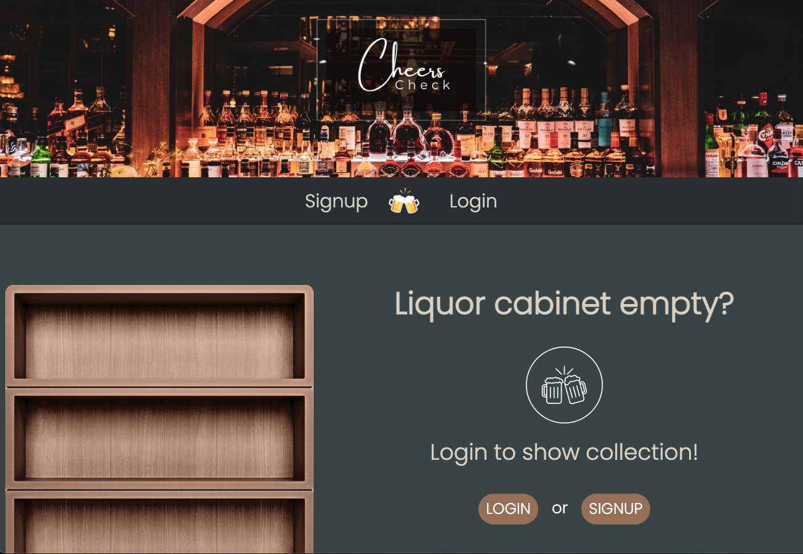

# Cheers Check 🍻

## Table of contents

- [Description](#description-📝)
- [Overview](#overview-📁)
  - [User experience](#user-experience-👤)
  - [Screenshot](#screenshot-📸)
  - [Links](#links-🔗)
- [My process](#my-process-💡)
  - [Built with](#built-with-🔨)
  - [Useful resources](#useful-resources-📚)
  - [Continued development](#continued-development-🏗️) 
- [Author](#author-✏️)

<br>

#  Description 📝

- A web application where alcohol enthusiasts can keep track of what's in their liquor cabinet. Using Handlebars.js as the templating language, Sequelize as the ORM, and express-session npm package for authentication, as well as, anime.js for animation and DataTables for inventory visualization.

<br>

# Overview 📁 

<br>

## User Story

```md
AS A liquor enthusiast who collects different types of alcohol
I WANT to keep track of my liquor inventory
SO THAT I can  I can share with friends and other users who might have similar tastes.
```


## User Experience 👤 

<br>

- Clone the repository using:

```terminal
git clone https://github.com/AveryCaldwell/CheersCheck.git
```
-  Navigate to the folder using the terminal.

-  Use the [MySQL2](https://www.npmjs.com/package/mysql2) and [Sequelize](https://www.npmjs.com/package/sequelize) packages to connect your Express.js API to a MySQL database and the [dotenv](https://www.npmjs.com/package/dotenv) package to use environment variables to store sensitive data.

-  Install dependencies using:
```terminal
npm install
```
-  Log in to your MySQL using:
```terminal
mysql -u root -p
```
-  Create the database:
 ```terminal
source db/schema.sql
```
-  Exit MySql using the command: `quit`.

- Run the following command to seed data to your database:
 ```terminal
 npm run seed
```
- Start the application:
```terminal
npm start
```

<br>


## Screenshot 📸
​<br>




###  Links 🔗

- Github URL: [https://github.com/AveryCaldwell/CheersCheck](https://github.com/AveryCaldwell/CheersCheck)
- Live Site URL: [https://dry-gorge-23555.herokuapp.com/](https://dry-gorge-23555.herokuapp.com/)

<br>
<hr>
<br>

##  My process 💡

###  Built with 🔨
- HTML, CSS, Bootstrap
- JavaScript
- MySQL, Sequelize
- Handlebars.js
- Node.js, Express
- Dotenv, Bycrypt
- Heroku, GitHub
- JSHint, Npm
- Masonry, Npm
- Anime.js


<br>

###  Useful resources 📚

- Emojis:   [https://github.com/ikatyang/emoji-cheat-sheet#office](https://github.com/ikatyang/emoji-cheat-sheet#office)
- MySQL2:   [https://www.npmjs.com/package/mysql2](https://www.npmjs.com/package/mysql2)
- Sequalize:    [https://www.npmjs.com/package/sequelize](https://www.npmjs.com/package/sequelize)
- dotenv:   [https://www.npmjs.com/package/dotenv](https://www.npmjs.com/package/dotenv)

<br>
<hr>
<br>


### Continued development 🏗️

- Ability to see friends profiles and what liquors they have added
- Ability to search for new cocktails to try out and our app will suggest recipes based on the ingredients you have on hand.
- Would like to implement passport.js. Passport is authentication middleware for Node.js.A comprehensive set of strategies support authentication using a username and password, Facebook, Twitter, and more.

<br>
<hr>
<br>


## Author ✏️
- Avery Caldwell: GitHub - [https://github.com/AveryCaldwell](https://github.com/AveryCaldwell)
- Robert Schauss: Github - [https://github.com/appleschaussaa](https://github.com/appleschaussaa)
- Louis Kim: Github - [https://github.com/louiskgkim](https://github.com/louiskgkim)
- Mathew Sida-Nguon: Github - [https://github.com/mathewsida](https://github.com/mathewsida)

<br>

